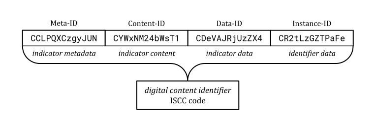
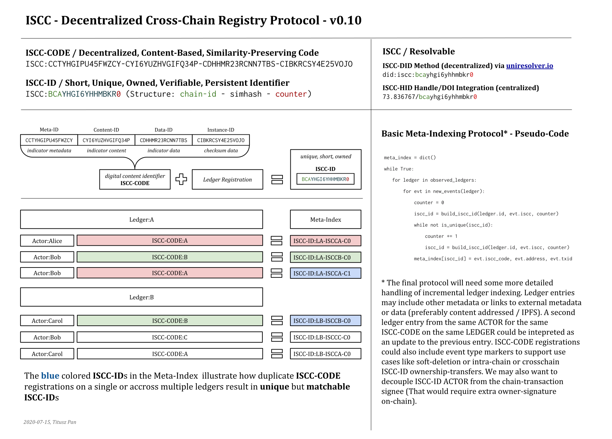

# iscc-registry

*HackFS- Decentralized Content Identifier Registry*

## Centralized Identifiers

Traditional commercial content identifiers like ISBN, DOI, ISRC, ISSN and many others usually identify "content" in an abstract sense and not files or data. They are mostly registry-based systems where an identifier is bound to an actor who controls what "content" is identified by a given id.

## Decentralized Identifiers

Technical folks use cryptographic hashes to identify data. This is a decentralized approach as it does not require a registry to create an identifier. But data is not the same thing as "content". Just assume one image encoded as PNG and as JPEG. While from a human and perceptual viewpoint, their "content" is identical, their hash-identifiers are uncorrelated. Cryptographic hashes like IPFS CID are used for addressing data. If you flip one bit in the data, you have a new CID that has no connection to the previous CID. But digital media content continuously re-encodes, resizes, and re-compresses, changing its underlying data as it travels through a complex network of actors and systems. How can we preserve content relations in self-describing identifiers?

## ISCC Codes

ISCC is a proposal that tries to establish a new paradigm. ISCC is a decentralized content-based hash. But unlike cryptographic hashes, it also preserves an estimate of the *data*, *content* and *metadata* similarity:




The ISCC is currently discussed at ISO for standardization (ISO/TC 46/SC 9/WG 18). Learn more about ISCC at 

- [ISCC Codes Website](https://iscc.codes)
- [ISCC Code generator web demo](https://iscc.coblo.net)

- [Introductory Presentation about ISCC](https://docs.google.com/presentation/d/1N0kZKMCFfB-JFMwnSJxWHOrAelTnH-puqPH_i7y3p1E/)

- [Talk about ISCC @ Blockchain for Science](https://www.youtube.com/watch?v=4OCvPrDhGuQ)


## Project Idea: A Decentralized ISCC Registry

### Why is a registry usefull?

- ISCC codes do not necessarily require a registry, so why do we want to build one?:
- Identifiers can be shorter when using a registry (citable).
- Identifiers can be owned by actors (metadata authority).
- Identifiers can have guaranteed uniqueness.
- Identifiers can be discovered by browing/searching a registry
- Identifiers can be resolved to metadata or data.

### How can we create a Decentralized Registry?

The idea is to design an open cross-blockchain registration protocol. Exercising the protocol materializes a global and publicly auditable meta-registry with short and unique content identifiers that bind digital content to actor identities. The architecture supports the discovery of identical and similar content registered by different actors across different blockchains. The protocol is quite simple:

- Generate a full ISCC Code
- Choose any shared public ledger that has a protocol implementation
- Register your ISCC with a signed transaction on the chosen ledger
- The rest is "history" ...

The ISCC Short-ID binds digital content to actor identities. The Short-ID emerges naturally from DLT transactions that are:
Public, Authenticated, Ordered, Immutable. Anybody who follows the cross-chain indexing protocol can build the state of the full ISCC Short-ID Index (meta-registry). The same ISCC Code may be registered by multiple actors on different chains. They all get different but matchable Short-IDs. A meta-registry resolves ISCC Short-IDs to a transaction (or its information) on a given chain that carries the full ISCC code and links to more metadata or the content itself on IPFS/Filecoin or elsewhere.



## Proof of Concept - Outline / Goals / Ideas

- [x] A basic protocol design for decentralized ISCC registration
- [x] A protocol implementation based on Ethereum / IPFS
- [x] An Ethereum contract that logs ISCC registrations including IPFS links
- [x] tool that registers ISCC codes on Ethereum and publishes metadata to IPFS
- [x] A meta-registry indexer that creates a ISCC Short-ID index by listening to contract events and offering resolver services.
- [x] A tool that resolves ISCC Short-IDs to ISCC Codes and metadata/data (maybe as DID method driver https://uniresolver.io/)

## POC Status

We have build a minimal end-to-end cli tool:

```bash
Usage: ireg [OPTIONS] COMMAND [ARGS]...

Options:
  -d, --debug  Enable debug mode
  --help       Show this message and exit.

Commands:
  deploy    Deploy ISCC Registry contract to chain.
  observe   Watch Registry contract and index ISCC-IDs
  register  Register a media asset.
  resolve   Resolve ISCC-ID via meta-index
```

## Installing and Running the POC
- Checkout code from github
- Install dependencies via `poetry install` (see: [Poetry](https://python-poetry.org/))
- Install and run [Ganache](https://www.trufflesuite.com/ganache)
- Install and run [IPFS](https://ipfs.io/#install)
- Deploy meta-index contract with `ireg -d deploy`
- Run meta-index observer with `ireg -d observe`
- Register an asset with `ireg -d register README.md`
- Resolve an ISCC-ID with `ireg resolve 27PH9o5ZNm1VC`

